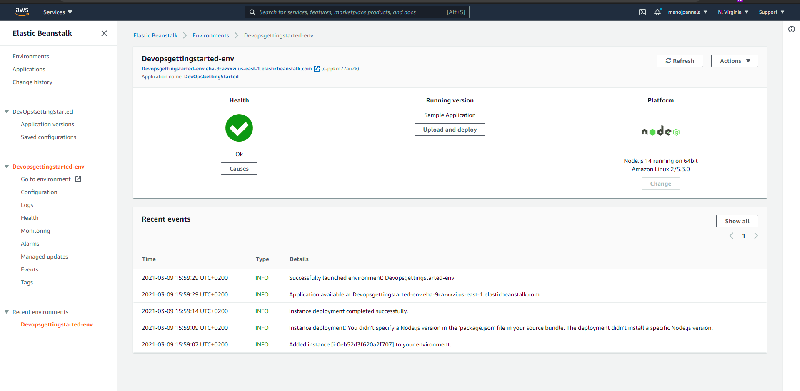
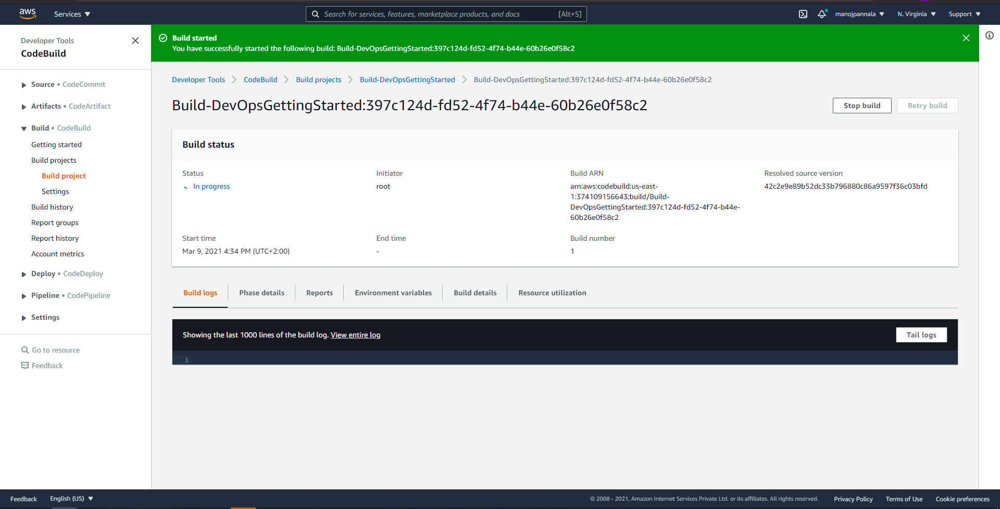
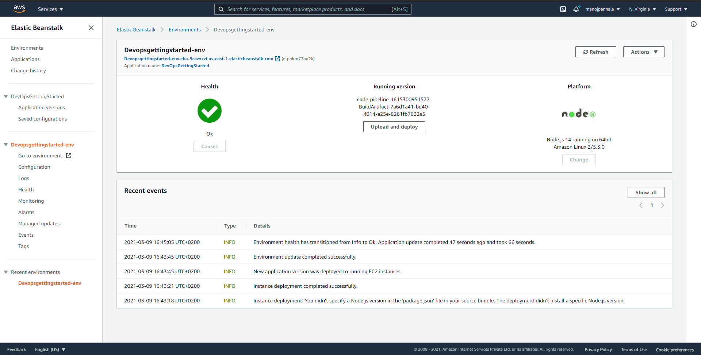
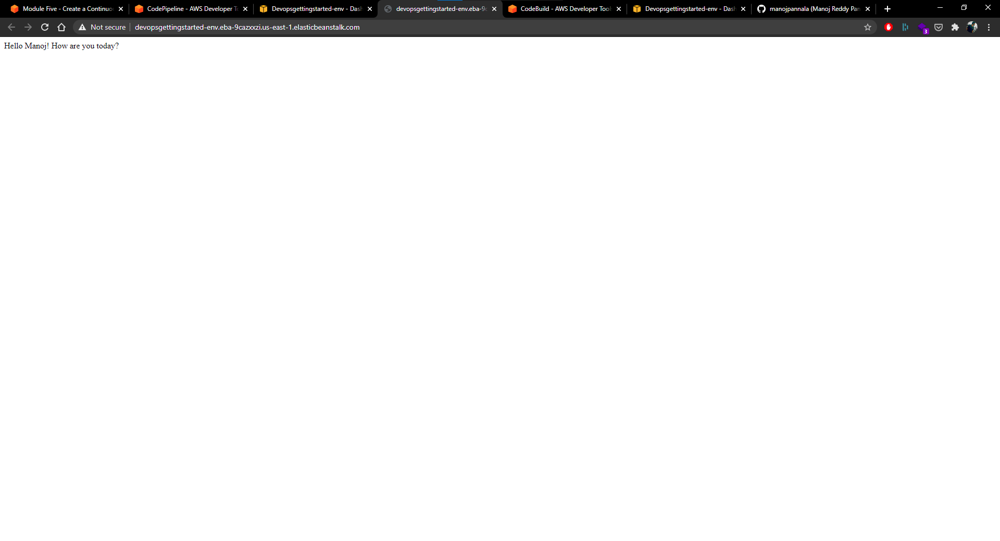

# AWS Elastic Beanstalk Node.js Sample App

This repository contains a sample Node.js web application built using [Express](https://expressjs.com/), meant to be used as part of the AWS DevOps Learning Path.

## Security

See [CONTRIBUTING](CONTRIBUTING.md#security-issue-notifications) for more information.

## License

This library is licensed under the MIT-0 License. See the LICENSE file.

# Screenshots

## Elastic Beanstalk

## AWS CodeBuild

## Final Build

## Output (Successful CodePipeline)
